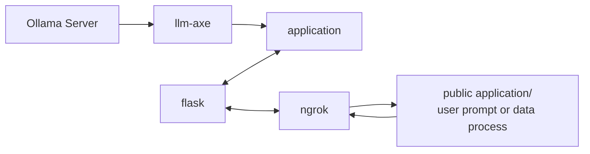
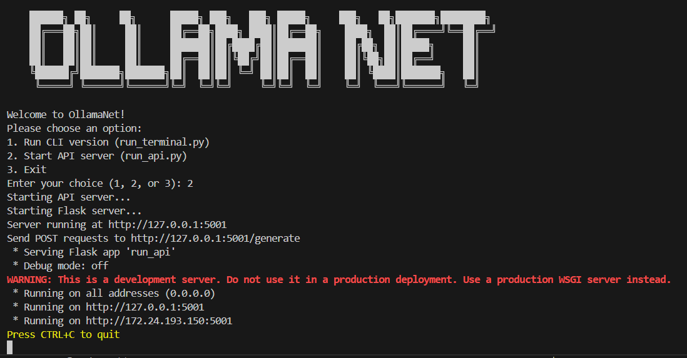

# OllamaNet
## A simple web enabled local LLM with API access

```
 ██████╗ ██╗     ██╗      █████╗ ███╗   ███╗ █████╗     ███╗   ██╗███████╗████████╗
██╔═══██╗██║     ██║     ██╔══██╗████╗ ████║██╔══██╗    ████╗  ██║██╔════╝╚══██╔══╝
██║   ██║██║     ██║     ███████║██╔████╔██║███████║    ██╔██╗ ██║█████╗     ██║   
██║   ██║██║     ██║     ██╔══██║██║╚██╔╝██║██╔══██║    ██║╚██╗██║██╔══╝     ██║   
╚██████╔╝███████╗███████╗██║  ██║██║ ╚═╝ ██║██║  ██║    ██║ ╚████║███████╗   ██║   
 ╚═════╝ ╚══════╝╚══════╝╚═╝  ╚═╝╚═╝     ╚═╝╚═╝  ╚═╝    ╚═╝  ╚═══╝╚══════╝   ╚═╝   
``` 


---




## Installation and Requirements
**Install Ollama**

```
curl -fsSL https://ollama.com/install.sh | sh
```

**Mac & Windows**
[Ollama Official Download Page](https://ollama.com/download)


---
**Run Ollama & Pull Your Preferred Model**
```
ollama serve
ollama pull deepseek-r1:1.5b
```
*You can simply run the Ollama application if your using a desktop environment*


---

**Run requirements.txt**
```
pip install -r requirements.txt
``` 

## Usage
### Choose between API or CLI mode 
```
python3 main.py
```     
     


#Final Steps to API Setup
**Eventually this will be automated within the app, for it's set up your own**  
```markdown
# Ngrok Tutorial: Expose a Flask App to the Internet

## Step 1: Create an Ngrok Account

1. Visit [ngrok.com](https://ngrok.com) and click "Sign up" to create a free account.
2. Sign up using Google, GitHub, or email and password.
3. Verify your email address if required.

## Step 2: Install Ngrok

1. After logging in, go to the Ngrok dashboard.
2. Download the Ngrok client for your operating system.
3. Extract the downloaded file to a convenient location.

## Step 3: Connect Ngrok to Your Account

1. In the Ngrok dashboard, find your authtoken.
2. Open a terminal and run the following command, replacing `<token>` with your authtoken:

    ```bash
    ./ngrok authtoken <token>
    ```

## Step 4: Create and Run a Flask App

1. Create a new Python file named `app.py` with the following code:

    ```python
    from flask import Flask
    app = Flask(__name__)

    @app.route('/')
    def hello():
        return 'Hello, World!'

    if __name__ == '__main__':
        app.run(port=5000)
    ```

2. Run the Flask app:

    ```bash
    python app.py
    ```

## Step 5: Expose Flask App with Ngrok

1. Open a new terminal window.
2. Run the following command to expose your Flask app running on port 5000:

    ```bash
    ngrok http 5000
    ```

3. Ngrok will display a URL that you can use to access your Flask app from anywhere in the world.

Now your locally running Flask app is exposed to the internet through Ngrok. Anyone can access it using the provided Ngrok URL.

## Citations

1. [Ngrok Docs - Getting Started](https://ngrok.com/docs/getting-started/)
2. [Expose a Local Web Server - Hashnode](https://sumanshunankana.hashnode.dev/expose-a-local-web-server-to-the-internet-example-flask-app)
3. [YouTube Guide](https://www.youtube.com/watch?v=hs7GLsHQCPQ)
4. [SitePoint - Using Ngrok](https://www.sitepoint.com/use-ngrok-test-local-site/)
5. [TutorialsPoint - Flask & Ngrok](https://www.tutorialspoint.com/how-to-run-python-flask-app-online-using-ngrok)
6. [Stack Overflow - Open Port 80](https://stackoverflow.com/questions/35176844/ngrok-how-to-open-port-80)
7. [Ngrok Developer Preview Guide](https://ngrok.com/docs/guides/developer-preview/getting-started/)
8. [Stack Overflow - Flask on Ngrok](https://stackoverflow.com/questions/72240708/cant-run-flask-on-ngrok)
9. [Raspberry Pi Forum Discussion](https://forums.raspberrypi.com/viewtopic.php?t=247177)
10. [Ngrok Docs - Flask Guide](https://ngrok.com/docs/using-ngrok-with/flask/)
```


## Credit & Acknowledgement 
### Emir Sahin
This project was made possible by Emir Sahin's work, who created llm-axe. My goal here was to expand upon the idea, make it more accessible and add API access.
[Enhancing Local LLMs: Give Your Local LLM Internet Access Using Python by Emir Sahin](https://medium.com/@emirsah1/enhancing-local-llms-how-to-connect-your-llm-to-the-internet-using-python-4abfebbd4536)
[Emir Sahin, GitHub: llm-axe](https://github.com/emirsahin1/llm-axe)

