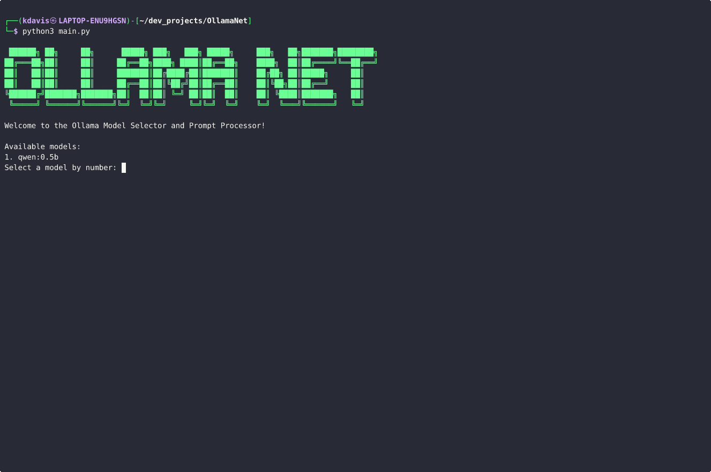

# OllamaNet
## A simple web enabled local LLM with API access

```
 ██████╗ ██╗     ██╗      █████╗ ███╗   ███╗ █████╗     ███╗   ██╗███████╗████████╗
██╔═══██╗██║     ██║     ██╔══██╗████╗ ████║██╔══██╗    ████╗  ██║██╔════╝╚══██╔══╝
██║   ██║██║     ██║     ███████║██╔████╔██║███████║    ██╔██╗ ██║█████╗     ██║   
██║   ██║██║     ██║     ██╔══██║██║╚██╔╝██║██╔══██║    ██║╚██╗██║██╔══╝     ██║   
╚██████╔╝███████╗███████╗██║  ██║██║ ╚═╝ ██║██║  ██║    ██║ ╚████║███████╗   ██║   
 ╚═════╝ ╚══════╝╚══════╝╚═╝  ╚═╝╚═╝     ╚═╝╚═╝  ╚═╝    ╚═╝  ╚═══╝╚══════╝   ╚═╝   
``` 


---


### Important! This is far from finished, you can checkout main.py for the foundational block of code to experiment. On the to-do list: add API functions, create a user interface to set up API easily, and work out a few bugs. I recommend using smarter models for this like DeepSeek.

## Installation and Requirements
**Install Ollama**

```
curl -fsSL https://ollama.com/install.sh | sh
```

**Mac & Windows**
[Ollama Official Download Page](https://ollama.com/download)


---
**Run Ollama & Pull Your Preferred Model**
```
ollama serve
ollama pull deepseek-r1:1.5b
```
*You can simply run the Ollama application if your using a desktop environment*


---

**Run requirements.txt**
```
llm_axe==1.1.9
ollama==0.4.7
```

## Usage
### CLI Application



## Credit & Acknowledgement 
### Emir Sahin
This project was made possible by Emir Sahin's work, who created llm-axe. My goal here was to expand upon the idea, make it more accessible and add API access.
[Enhancing Local LLMs: Give Your Local LLM Internet Access Using Python by Emir Sahin](https://medium.com/@emirsah1/enhancing-local-llms-how-to-connect-your-llm-to-the-internet-using-python-4abfebbd4536)

